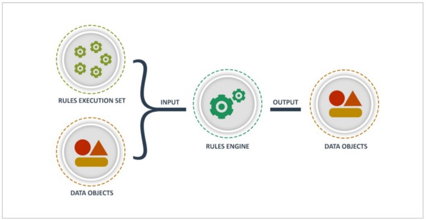
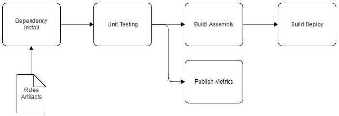
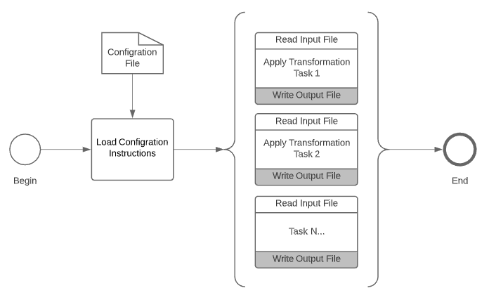

# Engineering
### Configuration Driven Design
Configuration driven design is a metadata first software development approach.

Metadata is the data used to describe properties and the arrangement of components in a given system. The metadata is best implemented using a widely accepted and human readable format such as YAML or JSON. This is an idea that has been tried and true for many years with great success across a wide variety of IT shops.

Let's unpack this concept a bit.

Here we have a process flow diagram with multiple boxes and connecting lines that describe a construction project.
Each box performs some action, while each line that connects the boxes has properties that describe the interaction between the boxes themselves.

These properties is what we refer to as the metadata.

You can see that the process remains the same even though it is leveraged to build a brand new home, condo or renovate an existing property before handing the keys to the client. This is very similar in how we apply a configuration driven design in the systems that we build. The same process remains intact while the individual components can be easily substituted and used in multiple ways.

One of the inherent pillars of the configuration driven design is that it allows us to reduce the volume of modifications to the code base. The configuration metadata is well suited to reflect continuous changes to business requirements, component parameters and sequence of execution. In addition, we can utilize non-engineering team members to perform and test configuration changes. As a result, engineers move faster as they focus on critical engineering tasks instead.

Another great pillar of the configuration driven design is the simplicity of the solution.
Team members can control entire system behavior using only the  configuration files.
These configuration files employ a human friendly naming convention and an easy to comprehend structure.
Simple text editing tools such as notepad or just about any other text editor can be sufficient enough to implement desired changes.

Ok, so now we know what configuration driven design is all about.
There are a few good rules to follow that will assure success and minimize implementation risks.
- Keep it simple, begin with very small set of parameters, tasks and business rules to minimize the complexity of the configuration file itself.
- Change the configuration only when needed, you do not need to account for all edge cases from the get go.
- Test continuously, after every change and no mater how small it is. The key here is the frequency of testing as well as the depth of the applied test cases.

Let's talk about the clear upside of this approach.

The configuration driven approach is a way to gain technology independence since the process complexity, that's the task execution sequence, parameters and business rules, are externalized away from the underlying implementation.  In effect, its a bit easier to swap out individual components of the system and their underlying technology. A consistent reuse of configuration files will assist engineers to eliminate duplicated code. And when properly structured and labeled, configuration files can become code like in their effectiveness while retaining their user friendly appearance.

On the downside, we should avoid implementing sophisticated business rules using configuration files. Business rules are complex in nature and tend to evolve over time, as frequency of rule changes increases so does their complexity. There are widely used  rule engines such as Drools and InRule that are a much better suited for this purpose.  Of course, what defines a complex business rule is a judgment call, therefore it deserves its own conversation.

You can find the full code for this project at [https://github.com/fszale/configuration-driven-design](https://github.com/fszale/configuration-driven-design).

### Rules Engine
The only constant is change itself.

Business rules, data elements, boundary conditions and related metadata changes frequently. Rules engines provide a very effective approach to extrapolating the ever changing rules out of the fixed code base. Such an approach allows to expand the team capable of implementing logic changes and eliminates a need for an engineer to perform mundane code updates. Anyone on the project can now update business rules as required and engineers are allowed to focus on other critical parts of the project instead.



Over the years, I have observed and worked on many code projects that have implement various business rules as inline code. While this approach produced fast working code it has often yielded unnecessary maintenance work. The engineer would be forced to entertain a perpetual flow of minuscule tasks, more often than not with a sole purpose to change a single line of code. Rules engines have been around for a long time and served well as an alternative approach. Implementations of rules engines are not free of their own challenges and often come with limitations pertaining to performance and rule complexity. However, rules engine can empower business analysts and other project members to perform updates to business rules without a dependency on the engineer. Considering the nature of our universe with an ever increasing rate of changes to various business rules, scarcity of engineering resources and the never ending onslaught of tasks, rules engines have become a pervasive part of our coding landscape.

One of the great benefits of implementing a rules engine is an opportunity for implementing a continuous integration and continuous delivery (CI/CD) process. Given that the rules themselves can and should be versioned as code, it only makes sense to implemented an effective deployment process. The following is a visualization of aforementioned process:



Imagine a CircleCi or Jenkins based deployment pipeline, where the dev/test deployment is kicked off as soon as rules source file is checked in. This is an effective approach to distribute workload of logic development among non-engineers and maintain consistent deployment process independent of who modifies the rules.

Another excellent benefit of implementing a rules engine is the depth of logging capabilities provided during the processing. In this example, I have utilized a Drools rules engine ([https://www.drools.org/](https://www.drools.org/)) and implemented enhanced logging capabilities to illustrate the depth of the information to be captured while processing data objects and evaluating complex rules. The example below illustrates several types of logged information, such as which rule was successfully evaluated, data lineage identifier to logically group lifetime processing of a particular data object, activity id to group batch data processing also referred to as an invocation instance.

```
...
2019-10-20 21:36:48 INFO  test-logger:120 - Rules engine initializing 0.0 ...
2019-10-20 21:36:49 INFO  test-logger:190 - CK CreateKieContainer
2019-10-20 21:36:49 INFO  test-logger:195 - CK Processing ruleKey: TestRules.drl
2019-10-20 21:36:49 INFO  test-logger:212 - CK Resolved ruleKey: TestRules.drl
2019-10-20 21:36:49 INFO  test-logger:226 - CK Adding module.
2019-10-20 21:36:49 INFO  test-logger:233 - CK Building ...
2019-10-20 21:36:52 INFO  test-logger:243 - CK Building Complete.
2019-10-20 21:36:52 INFO  test-logger:252 - CK Return new container.
2019-10-20 21:36:53 INFO  test-logger:124 - Rules engine initializing 0.1 ...
2019-10-20 21:36:53 INFO  test-logger:138 - Rules engine initialized.
2019-10-20 21:36:53 INFO  test-logger:60 - RulesEngine obj created dataLineageId: 123.0 runActivityId: ABCDEF
2019-10-20 21:36:53 INFO  test-logger:7 - Check_sqfootage_over1000 was invoked
2019-10-20 21:36:53 INFO  test-logger:131 - [RULE_ENGINE] : {"dataLineageId":"123.0","runActivityId":"ABCDEF","Package":"com.rules.test123","Rule":"init_logger"}
2019-10-20 21:36:53 INFO  test-logger:131 - [RULE_ENGINE] : {"dataLineageId":"123.0","runActivityId":"ABCDEF","Package":"com.rules.test123","Rule":"check_sqfootage_over1000"}
...
```

Imagine detailed dashboards that summarize the rules processed at multiple complexity levels and deriving unique insights into the flow of processed data and rules applied across time. These dashboards and associated charts can only be derived from the data written to the logs.

I have assembled a base project to illustrate an implementation of a Drools rules engine, a rules engine code factory to cache rule sets, property files, log files and sample set of processing rules to be applied to a test data entity. This code is fully reusable out of the box, can be leveraged in a Java based project and deployed across various containers such as AWS Lambda, EC2, AWS Glue (PySpark), EMR and others.

You can find the full code for this project at [https://github.com/fszale/drools-rules-engine](https://github.com/fszale/drools-rules-engine).
I have been using a rules based approach very successfully over many years and in a wide variety of systems. Most recently, my focus is on development of Big Data ETL processing with Spark/PySpark, data science and machine learning solutions where rules engines seem to thrive tremendously.
### Code Generator
Writing code to generate code is a winning strategy.

Over the years I have written a lot of code. Typically, the code was purpose built to represent objects in memory, perform object value manipulation according to predefined rules then persist the output somewhere. Simple. Yet, I have often wondered if much of that code had to be written in the first place. As I have pondered such questions, my long term memory started to activate providing ample flashbacks of various projects. There were a good number of them where I have purposefully applied a code generator. Perhaps, I did have a moment of brilliance in the past and did not force myself to write everything from scratch. Perhaps the concept of a scaffolding code generator has been around for a long time … perhaps it is the secret behind an awe inducing productivity of small teams … perhaps it should be a major component of code writing code, perhaps …

I have been a long time subscriber of this concept. In fact, the code generation has been a key success factor on a number of projects I have been involved in. So, after a short deliberation, several late night hours and intravenous delivery of caffeine (delicious coffee) I have produced a simple python based code generator to illustrate the concept of a configuration driven code generator.

The process begins with the code initializing itself with instructions contained in the JSON configuration file. The main engine class then invokes those instructions in sequence, instantiating specified implementation class, passing in additional parameters and invoking the main process (take action) method, process diagram is featured below.



The following is a sample of a JSON based configuration file that drives the code generator engine. As specified, the “implementation” parameter identifies the class to be instantiated to perform a primary action, while “params” section contains all of the specific values controlling the processing invoked. This is a simple and effective implementation of a configuration driven (functional programming) paradigm.

```
{
    "name": "Code Generator",
    "description": "Your application description...",
    "version": "0.1.0",
    "task_list": [
        {
            "task_name": "your.task.name",
            "implementation": "folder.module_name.class_name",
            "params": {
                "source": {
                    "file_name": "./file_path"
                },
                "transformer": {
                    "file_name": "./file_path"
                },
                "output": {
                    "file_name": "./file_path"
                }
            }
        },
    ...
    ]
}
```

An interesting component of this generic code generator is that each of the tasks can be easily swapped out with an alternative implementation or simply expanded upon. The code generator engine is driven purely by the JSON configuration file and as such can be re-purposed for various applications. The provided example performs two simple transformations, first is an XSLT transformation of an XML file that produces a JSON file with its own unique format representing all of the data contained in the input file. The second transformation produces a series of working Python based classes as defined by the contents of the XML input file. This example can be easily extended with additional transformations to produce Java, .NET or other code. In fact, this code generator is so generic that it can be used to produce other JSON based configuration files and code generators.

You can find the code for this project at [https://github.com/fszale/object-to-code-generator](https://github.com/fszale/object-to-code-generator).

I have been using this model of code generation to successfully produce code and configuration files. The input to the generator consist of object definitions documented with modeling tools that export XML based entity definition files. However, this is just one possible use and you are encouraged to fork and modify the provided code base. Python was the language of choice as majority of my time is focused on big data and machine learning projects, however, given the simplicity of this project the code could easily be ported to language of your choice.
### “Moonshot” Architecture
Discuss future state also known as the “moonshot”. Great future vision is an effective tool to refocus the team and provide a vital shot of optimism. Help the team to embrace a thought process where nothing is impossible. Let the “moonshot” be the ultimate software product that the team rallies around. The vision will be refined with actual input from clients, business partners and realities of software development and product delivery schedule.

Design “moonshot” architecture with the entire team. Include everyone in the design phase, begin with defining system capabilities (Data Flow Diagram Level 0 — context diagram) and progress through the subsequent DFD levels vetting various concepts as much as possible. Having full team participation gives everyone an open forum to contribute and address their concerns. It is a simple and effective method of developing individual buy in and an opportunity to address any architectural weakness in front of everyone. This approach delivers decision making transparency and implements an inclusive design approach.
### Loose Coupling
Decouple major system components (ingestion, compute and delivery). If applicable, apply a message bus architecture (Kafka driven or similar) to drive the micro services (tasks, producers, consumers) machinery as well as implement independent system layers. Incoming data (ingestion) processing has to be considered as its own system, with dedicated data flow cadence, operations, monitoring and SLAs. The compute layer runs independently as well, with a dedicated tech stack that may vary greatly from the ingestion or the delivery systems. This is where the rules engines and streaming as well as batch (spark or similar) technologies rein supreme. The delivery system, again a fully independent, also has its own SLAs, redundancy and processing for each of its subscribers (consuming clients). This independent layers approach (three layers or more) provides an architecture that scales and operates according to the identified system processing needs that are independent of each other. This is a practical and effective implementation of multiple best of breed architectures as part of a single system.
### DevOps First
Democratize CI/CD pipeline. Do not allow the project to depend on a single person to be responsible for this activity . Empower all of the engineers to be able to implement a Continuous Integration/Continuous Deployment pipeline. Encourage them to understand the process first, then build it and finally deploy to the test environment frequently. If possible, develop this deployment pipeline as early on as possible and standardize the process. You can depend on the DevOps for production releases only.

Democratize business rules creation and maintenance. Implement a rules engine and help to get the engineers out of the way. On most projects, variety of processing tasks and their configuration, often referred to as business rules, can and should be managed by non engineers (business analysts, product owners). Rules change over time (data defaults, verification rules, transformation rules, validation rules), it only makes sense to let those responsible for managing these rules to be the ones that can implement them. Demonstrate practical application of rules and rule engines in the process of data transformation. Discuss all the pros and cons to help to educate everyone on the team. Generic rules engines, such as Drools, are a great choice for externalizing processing logic and can serve well across a variety of technology stacks and architectures.
### Design Backwards
Start system design backwards. Begin to create dashboards first, walk the entire process back to the source of the initial data. While designing system outputs (dashboards, export files, reports) consider user roles. What is important to whom? How would each of the user roles find out more about the particular data point? Where and how do they see the detail? Accounting for user roles first forces the design to be mindful of the end user from day one. This approach allows for early validation of the product with the end users, as well as greatly increases probability of a successful system delivery and warm reception it will undoubtedly receive.
### 5 Pillars of Excellence
Discuss five pillars of excellence from AWS and its application in the context of the “moonshot” system. This is an extremely important exercise as it often drives all the members of the team to a lively participation and forces in depth system considerations from all angles. The five principals cover operational excellence, security, reliability, performance efficiency, and cost optimization. All are vital and must be properly vetted prior and during the product construction. This is also an excellent approach to document due diligence for the management, help to educate the team on the complexities of the considerations effectively producing a more refined system architecture, one that adequately reflects current and future system considerations. More information can be found at [https://aws.amazon.com/blogs/apn/the-5-pillars-of-the-aws-well-architected-framework/](https://aws.amazon.com/blogs/apn/the-5-pillars-of-the-aws-well-architected-framework/).
### Metrics For Everything
### Debugging
